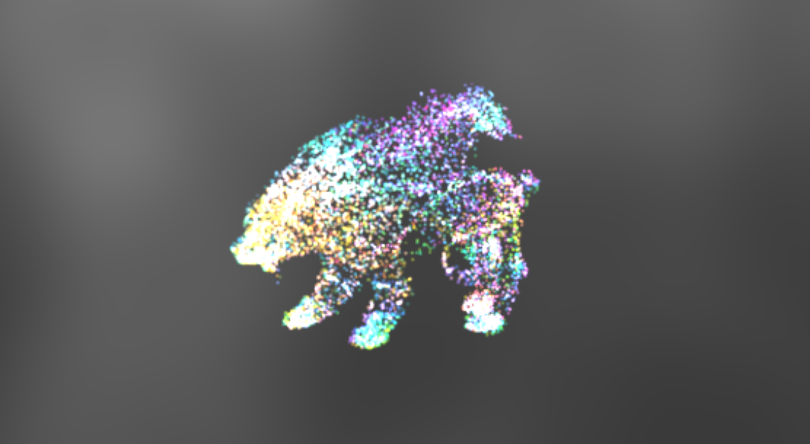

# Project 6: Particle System

## Student Info

- Name: Mauricio Mutai
- PennKey: `mmutai`

## Live Demo

Click below for the live demo!

### Quick Start

- Keeping the force field enabled will make the particles create a ribbon-like pattern.
- If click forces are enabled, you can click and hold:
  - the left mouse button, to attract particles
  - the right mouse button, to repel particles
- You can hold both buttons at once!
- You can select a mesh from the drop-down menu to make the mesh attract the particles.

## Techniques Used

### Particles

- Each particle stores a position, velocity, acceleration, and color.
- Its `update()` function uses simple Euler integration to compute its next position and velocity.

### Particle System

- The `ParticleSystem` class stores all the particles, as well as the VBOs used for instanced rendering (i.e., positions and colors for each particle). Each particle is rendered as a billboard.
- It manages updating them on each tick. In its `update()` function, for each particle, the `ParticleSystem`:
  - applies relevant forces to the particle
  - calls the particle's own `update()`
  - updates the particle's color
  - updates its instance VBOs
- At the end of its `update()`, the system passes the new instance VBOs to the square geometry.
- The particle system can apply one of a few coloring methods to its particles. One of them ("Rainbow") depends on the direction of the particle's velocity, while the other three depend on the particle's speed (length of velocity vector).
  - The "Rainbow" method maps the normalized direction to RGB space.
  - The other methods use a palette created with [Adobe's color wheel](https://color.adobe.com/create/color-wheel/). Since each palette has five colors, these coloring methods discretize the particle's speed values into five buckets, which map directly to the colors on the palette. For example, on the "Minty" palette, slow particles are cyan, while faster particles are green.
- The particle system can also apply an optional "spherical force field". This name comes from the fact that the computation of the field's forces resembles the computation of the tangent and bitangent vectors of a point on a sphere. This is the force field that can be toggled on the GUI.

### Target Forces

- A `TargetForce` represents a force that makes a particle move towards or away from a specified target position.

#### Attractor

- The `Attractor` forces, when applied to a particle, will add acceleration towards the target. This acceleration is scaled by the distance to the target (clamped to an appropriate range), such that more distant particles move more quickly towards the target.
- In addition, the `Attractor` will attempt to slow down the particle if it is already somewhat close to the target. This was done to avoid an effect where particles would never "converge" towards the target. They would instead oscillate around the target, and this oscillation had an undesirably large amplitude. With this, the `Attractor` is able to make particles "orbit" around the target, albeit a bit chaotically.

#### Repeller (or Repulsor)

- The `Repeller` forces, when applied to a particle, will add acceleration away from the target. This acceleration is scaled by the *inverse* of distance to the target (clamped to an appropriate range), such that more distant particles are not significantly affected by this force.

## External References
- [Stack Overflow post about tracking mouse position in JavaScript](https://stackoverflow.com/questions/7790725/javascript-track-mouse-position)
- [Mozilla documentation for addEventListener (for getting mouse position)](https://developer.mozilla.org/en-US/docs/Web/API/EventTarget/addEventListener)
- [Mozilla documentation for MouseEvent (for getting mouse position)](https://developer.mozilla.org/en-US/docs/Web/API/MouseEvent)
- [Stack Overflow post about generating random points inside triangle](https://stackoverflow.com/questions/19654251/random-point-inside-triangle-inside-java)
- [Stack Exchange post about generating random points inside triangle](https://math.stackexchange.com/questions/18686/uniform-random-point-in-triangle)
- [The Models Resource, where I got the OBJs from](https://www.models-resource.com/)

**Goal:** to make physics-based procedural animation of particles and to practice using OpenGL's instanced rendering system.

**Inspiration:** DMD and CGGT alumnus Nop Jiarathanakul's [Particle Dream application](http://www.iamnop.com/particles/).

## Particle collection (30 points)
Add whatever code you feel is necessary to your Typescript files to support a collection of particles that move over time and interact with various forces in the environment. Something like a `Particle` class could be helpful, but is not strictly necessary. At minimum, each particle should track position, velocity, and acceleration, and make use of an accurate time step value from within `main.ts`'s `tick()` function. You may use any integration method you see fit, such as Euler, Verlet, or Runge-Kutta.

You'll probably want to test your code on a small set of particles at first, and with some simple directional forces just to make sure your particles move
as expected.

## Procedural coloration and shaping of particles (15 points)
Your particles' colors should be determined in some procedural manner, whether it's based on velocity, time, position, or distance to target point. Your particle coloration scheme should follow one of the color palette techniques discussed in Tuesday's class so that your particle collection seems coherently colored. The shape of your particles may be whatever you wish (you're not limited to the basic gradiated circle we provided in the base code). You can even use a texture on your particle surface if you wish. Feel free to set up another instanced data VBO to vary the shape of your particles within the same scene.

## Interactive forces (25 points)
Allow the user to click on the scene to attract and repel particles from the cursor (consider ray-casting from the clicked point to place a 3D point in the scene from which particles can flee or move towards).

You might also consider allowing the user the option of activating "force fields", i.e. invisible 3D noise functions that act as forces on the particles as they move through the scene. You might even consider implementing something like [curl noise](https://petewerner.blogspot.com/2015/02/intro-to-curl-noise.html) to move your particles. Creating a visualization of these fields by drawing small `GL_LINES` in the direction of the force every N units in the world may be helpful for determining if your code works as expected.

## Mesh surface attraction (20 points)
Give the user the option of selecting a mesh from a drop-down menu in your GUI and have a subset of your particles become attracted to points on the surface of the mesh. To start, try just having each vertex on the mesh attract one unique particle in your collection. For extra credit, try generating points on the surfaces of the mesh faces that will attract more particles. Consider this method of warping a 2D point with X, Y values in the range [0, 1) to the barycentric coordinates (u, v) of any arbitrary triangle:

`(u, v) = (1 - sqrt(x), y * sqrt(x))`

You can map these (u, v) coordinates to a point on any triangle using this method from `Physically Based Rendering From Theory to Implementation, Third Edition`'s chapter on triangle meshes:

Consider pre-generating these mesh attractor points at load time so your program runs in real time as you swap out meshes.

## \~\*\~\*\~A E S T H E T I C\~\*\~\*\~ (10 points)
As always, the artistic merit of your project plays a small role in your grade. The more interesting, varied, and procedural your project is, the higher your grade will be. Go crazy, make it vaporwave themed or something! Don't neglect the background of your scene; a static gray backdrop is pretty boring!

## Extra credit (50 points max)
* (5 - 15 points) Allow the user to place attractors and repulsors in the scene that influence the motion of the particles. The more variations of influencers you add, the more points you'll receive. Consider adding influencers that do not act uniformly in all directions, or that are not simply points in space but volumes. They should be visible in the scene in some manner.
* (7 points) Have particles stretch along their velocity vectors to imitate motion blur.
* (5 - 15 points) Allow particles to collide with and bounce off of obstacles in the scene. The more complex the shapes you collide particles with, the more points you'll earn.
* (30 points) Animate a mesh and have the particles move along with the animation.
* (15 points) Create a "flocking" mode for your scene where a smaller collection of particles moves around the environment following the [rules for flocking](https://en.wikipedia.org/wiki/Boids).
* (15 points) Use audio to drive an attribute of your particles, whether that be color, velocity, size, shape, or something else!
* (50 points) Create a cloth simulation mode for your scene where you attach particles to each other in a grid using infinitely stiff springs, and perform relaxation iterations over the grid each tick.
